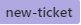
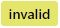
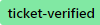
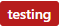
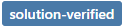
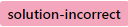
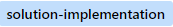

# lafi-sa.issues
Issue only repo for public. Please report all issues of lafi-sa.com in this repo

**Steps to follow while reporting bugs**

1. Give a suitable title
2. Give a breif description of the issue
3. Specify how to reproduce the issue
For example:
  Go to this URL : <https://.....>
  Click this button  
  Click that button
  Then this problem occurs
  
4. Give images of the issue
5. Mark the error part of the image in a red box so that it is visible to the developer
6. Apply the label **new-ticket** from the label list (VERY IMPORTANT)

The raised issue will be checked by the website administrator and will be forwarded to the 
developer for correction/implementation

The website developer can also reject the issue if it is not a bug

**Actions for administrator**
##### 1. Check tickets with  labels #####
  * Verify that the staff report is correct
  * Verify that the required URL, images, reproducing steps are correct
  * If adequate information not given, tag the respective staff with **@staffUserName** followed by what is missing in the ticket as comments
  * Verify if the issue is reproducible in testingServer. 
  If yes, then mention **reproduced in testServer** with the URL, else,  mention **not reproducible in testServer**
* If you find that the reported issue is not actually a bug, but something wrong with the staff actions or others, close the ticket by applying the  
Also, mention suitable comments, as to why you are closing the ticket
 * If everything fine, then remove  and apply 
  * Mention comments for developer if any using **@developerName** followed by the comment
 * Update the *assignes* list by removing your name and then add the developer name
  
##### 2. Check tickets with  labels #####
* Verify whether the issue has been fixed
* Verify no other functionalities have been affected
* If verification successful, then remove  label and apply 
* If verification failed, then remove  label and apply , and mention clearly in the comments as to what is happening
* Update the *assignes* list by removing your name and then add the developer name

**Workflow** 
1. Tester (Lafi staff) raises a new ticket with label 
2. Administrator will check the ticket, verifies it and applies label  if it is genuine, else will apply  if the issue is not valid
3. Developer will pick up verified tickets and apply 
4. After it is fixed by developer and merged to the testServer, he will apply  to the ticket
5. The administrator and/or tester will verify that the issue has been fixed and apply  if the issue has been fixed, else, will apply  if the issue did not fix
6. If solution is incorrect, the developer will try to fix the issue again and apply  after making changes
7. If verified, the developer will close the ticket after the issue fix has been merged to the mainLine server
